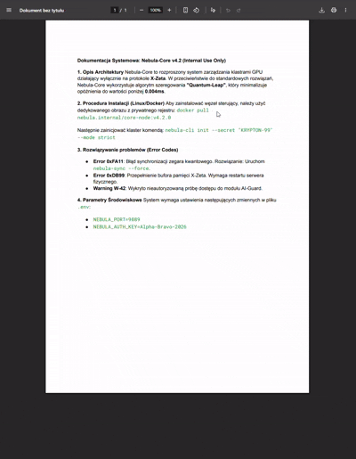

# Private Knowledge Edge Appliance

A RAG (Retrieval-Augmented Generation) application that allows you to chat with your PDF documents using a local LLM (Ollama) and Vector Database (Qdrant).

<p align="center">
  
</p>

## Tech Stack

- **Backend**: .NET 8 Web API
- **Frontend**: Angular + PrimeNG
- **AI/ML**: Ollama (Llama 3.2), Qdrant (Vector DB)

## 🚀 Quick Start in 1 Step

You can run the entire stack (Frontend, Backend, Database, AI) using Docker Compose.

### Prerequisites

- [Docker Desktop](https://www.docker.com/products/docker-desktop/) installed and running.
- (Optional) NVIDIA GPU drivers if you want GPU acceleration for Ollama.

### Run

1.  Clone this repository.
2.  Run the following command in the root directory:

```powershell
docker-compose up --build
```

That's it!

- **Frontend**: Open [http://localhost:4200](http://localhost:4200)
- **API Swagger**: Open [http://localhost:5000/swagger](http://localhost:5000/swagger)
- **Qdrant Dashboard**: Open [http://localhost:6333/dashboard](http://localhost:6333/dashboard)

_Note: The first launch might take a few minutes as it downloads the LLM models (Llama 3.2 and Nomic Embed)._

## Development

If you want to run components individually:

### Backend (API)

```powershell
cd API
dotnet run
```

### Frontend

```powershell
cd PrivateKnowledgeEdgeAppliance
npm install
npm start
```
